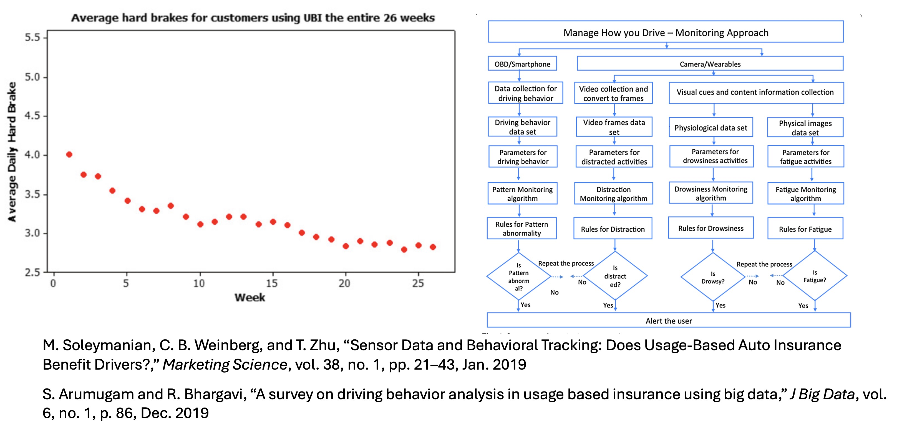
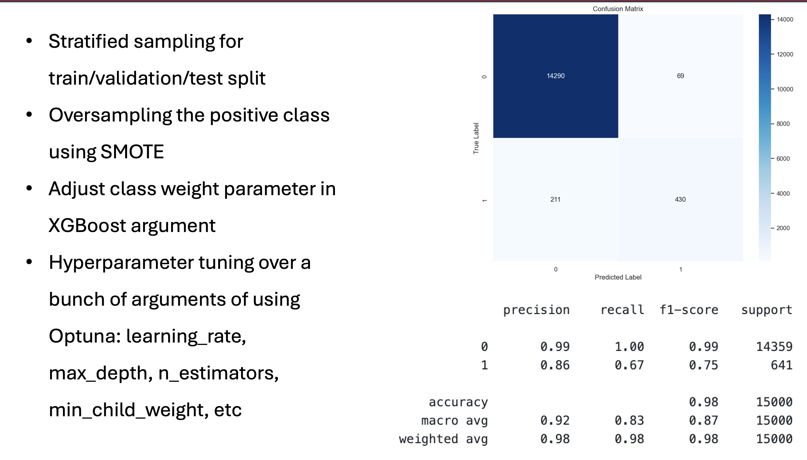
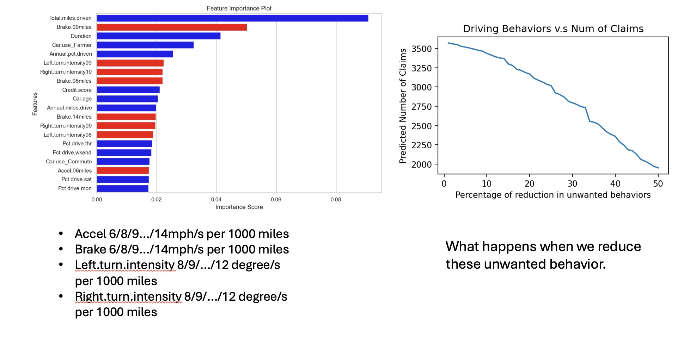
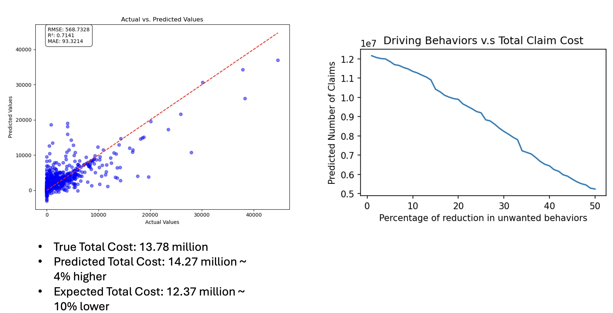
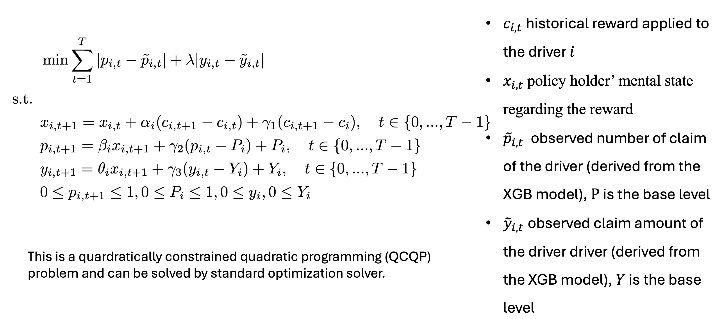
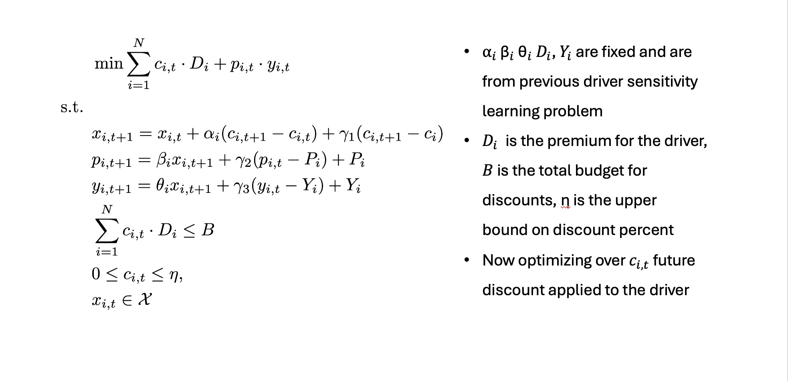
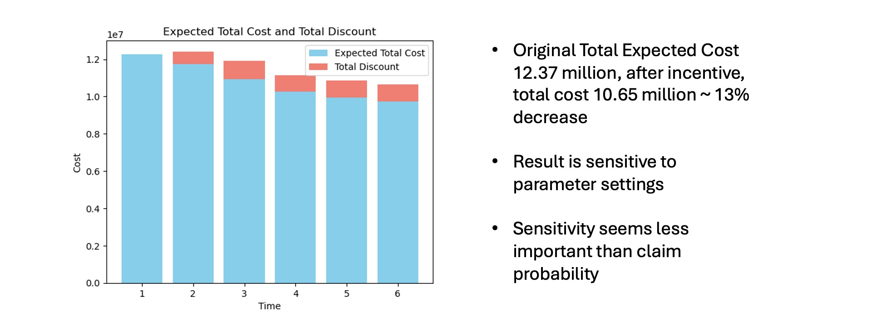

# Adaptive Pricing for Auto Insurance Using Machine Learning and Optimization

## Project Overview
This research project focuses on using machine learning and optimization methods to adaptively price auto insurance policies in order to maximize an insurance company's expected income.

## Motivation
The technology for collecting driver telematics data is advancing rapidly, enabling insurance companies to build more accurate driver risk profiles based on real-time driving data. Simultaneously, driver behaviors are positively influenced when enrolled in telematics data collection programs known as Usage-Based Insurance (UBI).

As illustrated below, research shows that drivers enrolled in UBI programs tend to reduce dangerous driving behaviors such as hard braking. Additionally, UBI programs typically include driver behavior monitoring systems that alert drivers when potentially dangerous behaviors are detected.

## Our Approach
We aim to quantitatively and efficiently leverage this behavioral effect from an insurance company's perspective. Our key assumptions:

1. Drivers are incentivized by enrollment discounts for UBI programs
2. To qualify for premium discounts, drivers must maintain safe driving habits while being monitored
3. Drivers motivated by discounts will exhibit decreased crash risk (claim probability)

If the reduced claim costs outweigh the discounts offered, this creates a beneficial scenario for insurance companies. However, due to thin profit margins, companies must carefully calculate whom to offer discounts to and in what amounts. This is where our machine learning and optimization methods provide value.

## Machine Learning Models
Two factors directly related to a driver's claim cost are claim probability and claim amount. We trained various machine learning models to predict these factors using data from [this research paper](https://www.mdpi.com/2227-9091/9/4/58).

After evaluating neural networks, logistic regression, linear regression, and other approaches, **XGBoost** demonstrated superior performance for predicting both claim probability and claim amount. Our training methodology and classification results are shown below:

### Key Findings:
- Telematics-related factors showed high importance in predicting crash probability
- Reduction in undesirable driving behaviors (e.g., hard brakes of varying intensities) correlates with decreased crash probability, as shown below:

For claim amount prediction, we achieved an R² score of 0.71, which is substantial considering the inherent noise in insurance data and the variability in real-world claim amounts.

## Optimization Framework
A critical aspect of using discounts to encourage better driver behavior is accounting for varying discount sensitivity levels among drivers. Ideally, companies want to offer discounts to drivers who:
1. Are highly responsive to financial incentives
2. Currently exhibit high claim probability

We propose an optimization program to learn each driver's discount sensitivity through historical records of discount amounts and corresponding behavior changes. The optimization model is shown below:

This model assumes that discounts have a linear effect on driver claim probability and claim amount, while acknowledging that driving behavior tends to revert to a baseline without continued intervention.

Once we learn these sensitivity parameters (embedded in coefficients α, β, θ and base levels D, Y), we can use another optimization program to determine optimal discount allocation:

## Experimental Results
We validated our adaptive telematics-based framework through simulation. We assumed drivers' behavior changes according to our proposed model (linear relationship with discount, tendency to return to baseline) and randomized sensitivity parameters.

Over five iterations of providing discounts, observing reactions, and adjusting discount amounts, our algorithm demonstrated a **13% reduction** in expected total costs (discount cost + claim probability × claim cost) for the insurance company.

## Conclusion
This research demonstrates that combining machine learning predictions with optimization-based decision-making can significantly improve insurance pricing strategies while simultaneously promoting safer driving behaviors, creating a win-win scenario for both insurance companies and policyholders.